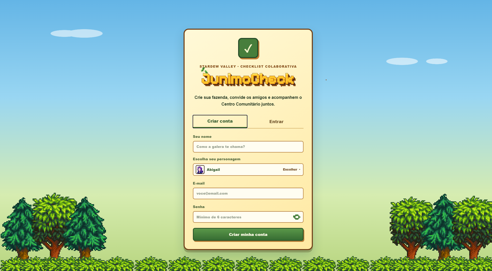
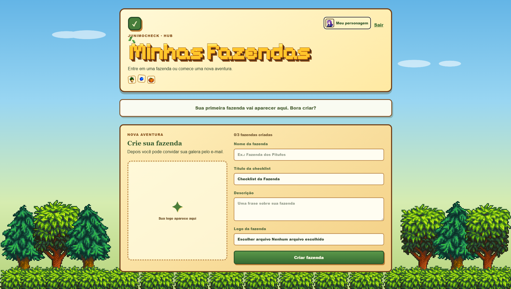
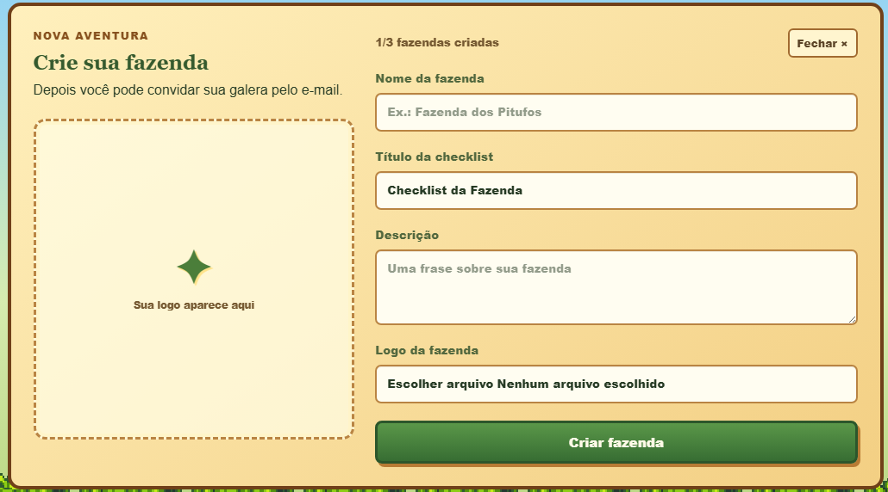
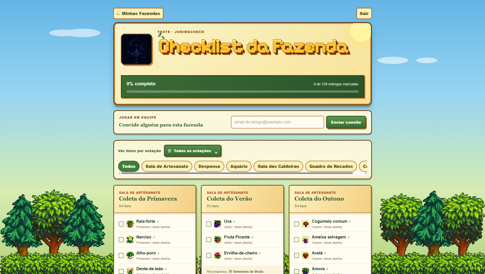
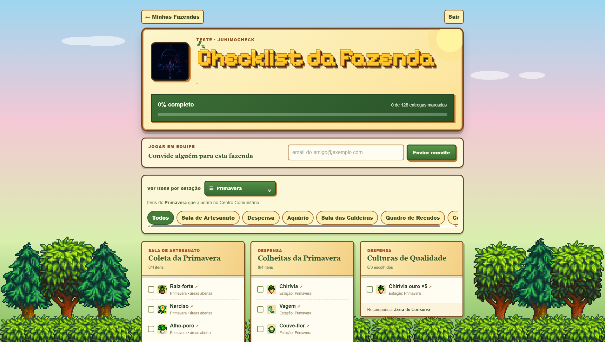
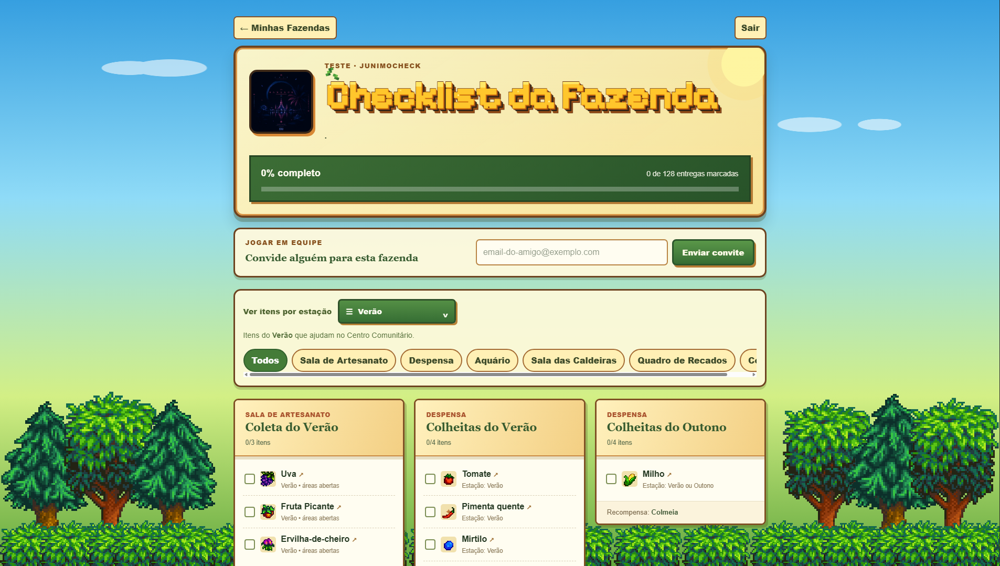
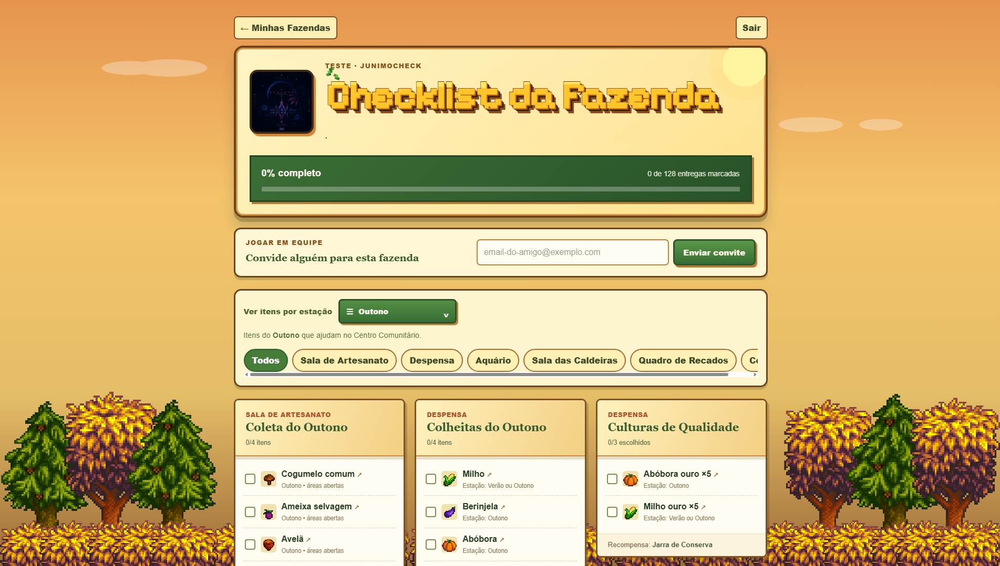
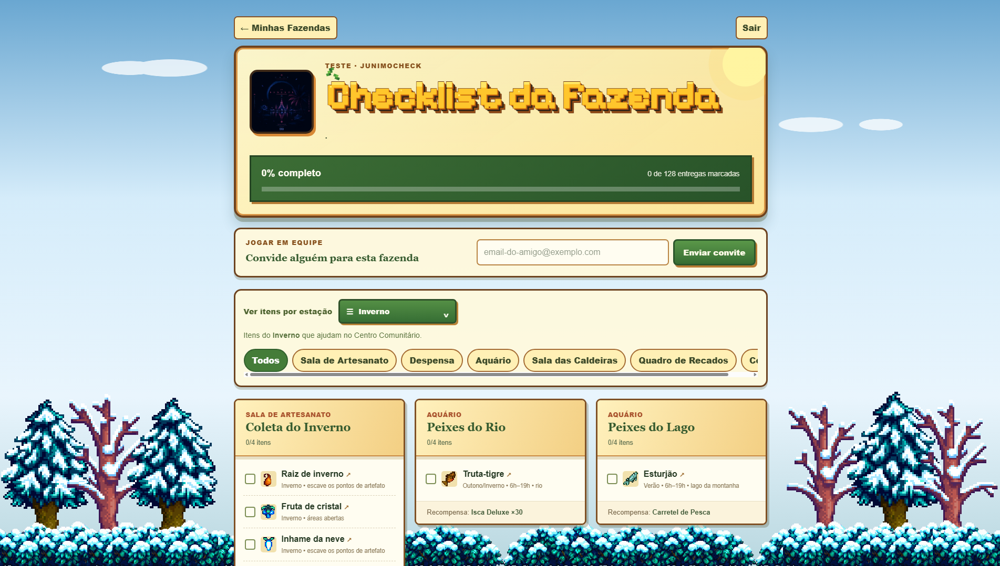

<div align="center">
  

# JunimoCheck

### Sua fazenda, sua equipe, tudo em dia.

Checklist colaborativa para organizar o Centro Comunitário de Stardew Valley com seus amigos, em tempo real.

<p>
  <a href="https://checklist-stardew-valley.manoelricardo847.workers.dev">
    
  </a>
  
</p>

<p>
  
  
  
  
</p>
</div>

## O projeto

A JunimoCheck nasceu de uma necessidade real da nossa fazenda: saber o que ainda faltava entregar no Centro Comunitário sem depender de mensagens, anotações ou uma pessoa atualizando tudo sozinha.

Cada jogador pode entrar na mesma fazenda, marcar itens e acompanhar o progresso compartilhado imediatamente.

## Conheça a JunimoCheck

<div align="center">
  <p><strong>Explore as principais telas do projeto</strong></p>
  <p>
    <a href="#conta"></a>
    <a href="#hub"></a>
    <a href="#fazenda"></a>
    <a href="#checklist"></a>
    <a href="#estacoes"></a>
  </p>
</div>

<a id="conta"></a>

## 01 · Criação de conta

Crie seu perfil, escolha um personagem de Stardew Valley e entre na sua equipe com uma identidade própria.



<p align="right"><a href="#o-projeto">↑ Voltar ao início</a></p>

<a id="hub"></a>

## 02 · Hub das fazendas

O hub reúne todas as fazendas do jogador em um só lugar, mostra os integrantes e dá acesso rápido a cada checklist.



<p align="right"><a href="#o-projeto">↑ Voltar ao início</a></p>

<a id="fazenda"></a>

## 03 · Criação da fazenda

Personalize o nome, o título, a descrição e a logo da fazenda antes de convidar a sua equipe.



<p align="right"><a href="#o-projeto">↑ Voltar ao início</a></p>

<a id="checklist"></a>

## 04 · Checklist colaborativa

Marque as entregas em tempo real, acompanhe o progresso compartilhado e filtre os pacotes por sala ou estação.



<p align="right"><a href="#o-projeto">↑ Voltar ao início</a></p>

<a id="estacoes"></a>

## 05 · Estações

Cada estação tem sua própria seleção de itens, paleta de cores e cenário. Use os botões para navegar diretamente para cada visual.

<div align="center">
  <p>
    <a href="#primavera"></a>
    <a href="#verao"></a>
    <a href="#outono"></a>
    <a href="#inverno"></a>
  </p>
</div>

<a id="primavera"></a>

### Primavera

> **Verde fresco e rosa suave:** cenário vivo para acompanhar os primeiros itens do ano.



<p align="right"><a href="#estacoes">↑ Voltar às estações</a></p>

<a id="verao"></a>

### Verão

> **Verde vibrante e dourado:** uma paisagem clara para as colheitas e pescarias do Verão.



<p align="right"><a href="#estacoes">↑ Voltar às estações</a></p>

<a id="outono"></a>

### Outono

> **Laranja, cobre e marrom:** folhas e árvores acompanham o clima da estação.



<p align="right"><a href="#estacoes">↑ Voltar às estações</a></p>

<a id="inverno"></a>

### Inverno

> **Azul-claro, branco e ciano:** neve, árvores congeladas e um visual mais frio para os itens do Inverno.



<p align="right"><a href="#estacoes">↑ Voltar às estações</a></p>

## Principais recursos

- Contas individuais e perfil com personagem escolhido.
- Até três fazendas por usuário.
- Convites por e-mail e gerenciamento dos integrantes.
- Progresso sincronizado entre toda a equipe.
- Pacotes do Centro Comunitário organizados por sala e estação.
- Informações de estação, horário e local de cada item.
- Links diretos para a Wiki de Stardew Valley em português.
- Bloqueio automático quando a quantidade necessária é atingida.
- Cenário e efeitos visuais que mudam com as estações.
- Interface responsiva para computador e celular.

## Autoria

Idealizado e desenvolvido por **Manoel Ricardo ([@Sp3llr](https://github.com/Sp3llr))**, com apoio de ferramentas de inteligência artificial durante o desenvolvimento e a documentação.

---

## Documentação técnica

<details>
<summary><strong>Executar no computador</strong></summary>

### Requisito

- Node.js 22.13 ou mais recente.

### Comandos

```bash
npm install
npm run dev
```

Abra o endereço informado pelo terminal.
</details>

<details>
<summary><strong>Publicar no Cloudflare Workers</strong></summary>

### Pelo painel da Cloudflare

1. Entre em **Workers & Pages**.
2. Selecione **Create** e depois **Import a repository**.
3. Conecte o GitHub e escolha este repositório.
4. Configure:

   - Build command: `npm run build`
   - Deploy command: `npx wrangler deploy`
   - Root directory: `/`

5. Salve e aguarde a publicação.

### Pelo terminal

```bash
npm install
npx wrangler login
npm run deploy
```

O arquivo `wrangler.jsonc` contém a configuração do Worker e dos arquivos estáticos.
</details>

<details>
<summary><strong>Configuração do Supabase</strong></summary>

O projeto usa o Supabase para autenticação, fazendas, convites, integrantes e progresso compartilhado.

Antes de publicar, confirme no painel:

- Políticas RLS ativas nas tabelas.
- Domínio da Cloudflare em **Authentication → URL Configuration → Redirect URLs**.
- Função `manage-farm-invites` publicada.
- Migrações de `supabase/migrations` aplicadas.

A chave presente no frontend é a chave pública `publishable/anon`, feita para uso no navegador com RLS. Nunca publique a chave `service_role`.
</details>

<details>
<summary><strong>Estrutura do projeto</strong></summary>

- `app/`: interface e regras do site.
- `public/`: imagens, sprites e fontes visuais.
- `supabase/`: migrações e função de convites.
- `worker/`: entrada do Cloudflare Worker.
- `wrangler.jsonc`: configuração da publicação.
- `docs/screenshots/`: imagens usadas nesta apresentação.
</details>

## Aviso legal

Este é um projeto de fãs e não é afiliado nem endossado por Stardew Valley ou ConcernedApe. Stardew Valley e seus assets pertencem aos seus respectivos proprietários.
