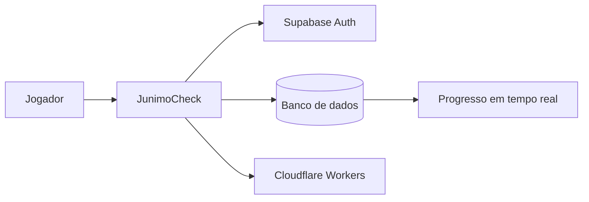

<div align="center">

# 🌿 JunimoCheck

### Sua fazenda, sua equipe, tudo em dia.

Checklist colaborativa do Centro Comunitário de Stardew Valley, feita para grupos acompanharem entregas, estações e progresso em tempo real.

[](https://checklist-stardew-valley.manoelricardo847.workers.dev)
[](https://workers.cloudflare.com/)
[](https://supabase.com/)

</div>

## Sobre o projeto

O **JunimoCheck** nasceu de uma necessidade real: organizar o Centro Comunitário com amigos sem depender de mensagens, planilhas separadas ou alguém lembrando o que já foi entregue. Cada grupo cria sua fazenda, convida integrantes e acompanha a mesma checklist online.

O projeto foi idealizado, dirigido e desenvolvido por **Manoel Ricardo ([@Sp3llr](https://github.com/Sp3llr))**, com apoio de ferramentas de inteligência artificial durante a prototipação, implementação e revisão.

## Funcionalidades

- Cadastro, login e redefinição de senha.
- Hub com até três fazendas criadas por conta.
- Convites por e-mail e gerenciamento de integrantes.
- Logo, nome, descrição e título personalizados por fazenda.
- Progresso sincronizado em tempo real entre todos os integrantes.
- Checklist completa do Centro Comunitário com filtros por sala e estação.
- Informações de estação, horário e local de cada item.
- Links dos itens para a Stardew Valley Wiki em português.
- Regras especiais para pacotes que exigem apenas parte dos itens disponíveis.
- Interface responsiva inspirada no universo de Stardew Valley.

## Tecnologias

| Camada | Tecnologia |
| --- | --- |
| Interface | React, Next.js e TypeScript |
| Build | Vinext e Vite |
| Banco e autenticação | Supabase |
| Tempo real | Supabase Realtime |
| Funções de servidor | Supabase Edge Functions |
| Hospedagem | Cloudflare Workers |
| Automação | GitHub Actions |

## Como funciona



## Executando localmente

### Requisitos

- Node.js 22.13 ou mais recente
- npm
- Projeto Supabase configurado

### Instalação

```bash
git clone https://github.com/Sp3llr/checklist-stardew-valley.git
cd checklist-stardew-valley
npm install
npm run dev
```

O endereço local será mostrado no terminal.

## Supabase

As migrações estão em [`supabase/migrations`](supabase/migrations) e a função responsável por fazendas, convites e integrantes está em [`supabase/functions/manage-farm-invites`](supabase/functions/manage-farm-invites).

Antes de usar outra instância do Supabase:

1. Aplique as migrações.
2. Publique a Edge Function `manage-farm-invites`.
3. Configure as URLs permitidas em **Authentication → URL Configuration**.
4. Confirme as políticas de Row Level Security antes de liberar o projeto.

> A chave `service_role` deve existir somente nos segredos protegidos da Edge Function. Nunca coloque essa chave no navegador ou em commits.

## Comandos

| Comando | Ação |
| --- | --- |
| `npm run dev` | Inicia o ambiente de desenvolvimento |
| `npm run lint` | Verifica a qualidade do código |
| `npm run build` | Gera a versão de produção |
| `npm run preview` | Testa o Worker localmente |
| `npm run deploy` | Publica no Cloudflare Workers |

## Roadmap

- [ ] Criar identidade visual original para substituir assets de terceiros.
- [ ] Adicionar mais idiomas.
- [ ] Permitir diferentes tipos de pacotes e configurações de jogo.
- [ ] Melhorar testes automatizados e acessibilidade.
- [ ] Criar domínio próprio para o JunimoCheck.

## Como contribuir

Leia o arquivo [CONTRIBUTING.md](CONTRIBUTING.md) antes de abrir uma issue ou pull request. Sugestões, relatos de bugs e melhorias são bem-vindos.

## Créditos e transparência

O JunimoCheck é um projeto independente de fã. Não é afiliado, patrocinado ou endossado por ConcernedApe. Stardew Valley, nomes, personagens e assets pertencem aos seus respectivos proprietários.

Alguns assets são utilizados apenas para identificação e ambientação do jogo. Consulte [NOTICE.md](NOTICE.md) para detalhes. O código e os assets de terceiros podem possuir condições de uso diferentes.

---

<div align="center">
Feito com 💚 por <a href="https://github.com/Sp3llr">Manoel Ricardo</a>.
</div>
